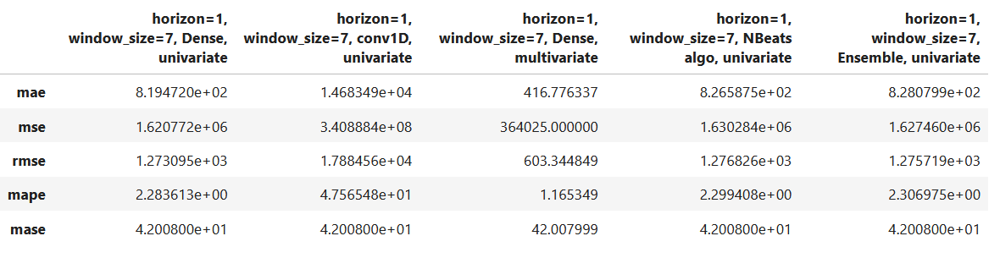

# Predict-bitcoin-price

Data from = https://www.investing.com/crypto/bitcoin/historical-data

Bitcoin prices from 2010-07-18 - 10/24/2023

Data: Daily Historical price of Bitcoin over the past years

Results of modeling experiments

    - Model 1 = Univariate Deep learing Dense model with horizon=1 and window_size=7

    - Model 2 = Univariate Deep learing CONV1D model with horizon=1 and window_size=7

    - Model 3 = Multivariate Deep learing Dense model with horizon=1 and window_size=7
    
    - Model 4 = Univariate Deep learing Dense model(NBeats algo) with horizon=1 and window_size=7
    
Replicating the [N-BEATS: NEURAL BASIS EXPANSION ANALYSIS FOR INTERPRETABLE TIME SERIES FORECASTING](https://arxiv.org/pdf/1905.10437.pdf) paper

    - Model 5 = Univariate Deep learing Dense emsemble model with horizon=1 and window_size=7

`fit on 3 differents metrics with different random initialization`

        
